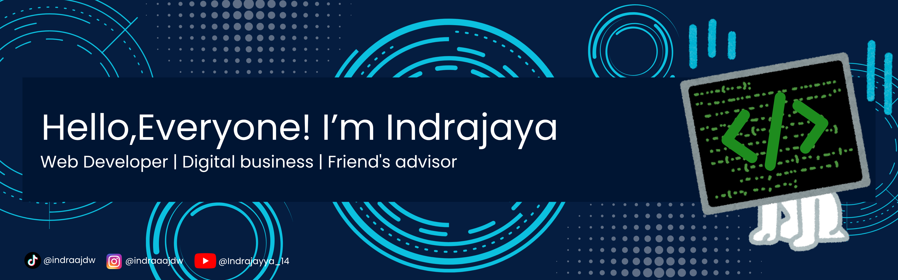

  

---

---

<h2 align="center">👨‍💻 About Me</h2>

<table align="center">
<tr>

<td width="35%" align="center" valign="middle">

  

</td>

<td width="65%" valign="top">

<b>🎂 Age</b> 
20 Years Old

  

<b>🎓 Education</b> 
Software Engineering Student at Universitas Pendidikan Ganesha (Undiksha), Bali

  

<b>📍 Location</b> 
Muncan Village, Selat District, Karangasem Regency, Bali, Indonesia

  

<b>🌱 Currently Learning</b> 
Full Stack Development

  

<b>💻 Passion</b> 
Building modern, responsive, and user-friendly web applications

  

<b>🏐 Hobbies</b> 
Learning new technologies & Playing Volleyball

  

<b>🚀 Goal</b> 
Becoming a Person Who Is Helpful and Useful

</td>

</tr>
</table>

---

---

##  Tech Stack

 

 

## 🛠 Tools

<!-- Development -->

 

<!-- Backend & Database -->

 

<!-- Frontend -->

 

<!-- Design -->

 

<!-- Productivity -->

 

<!-- Operating System -->

## 📊 GitHub Stats

---

## 🌟 Featured Projects

🩸 PMI Kabupaten Buleleng

Financial Management Information System using Laravel & Next.js.

🌍 Urban Heat Island Web GIS

Google Earth Engine + Flask + React + Leaflet.

🛒 BangunMart

Responsive E-Commerce Website.

🍔 Self Service Kiosk

Restaurant Self Ordering System.

---

## 📫 Connect with Me

GitHub:
https://github.com/indrajaya140506

---

⭐ Thanks for visiting my profile!
